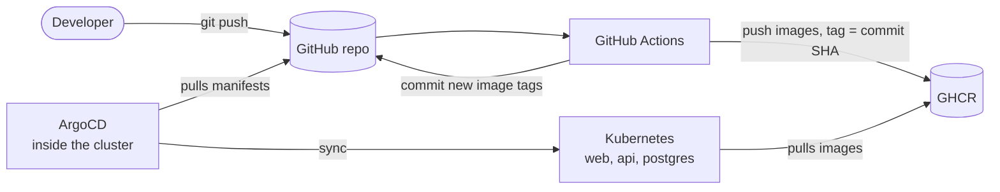

# GitOps Voting App

A three-tier voting app (Vue, Flask, PostgreSQL) deployed to Kubernetes. GitHub Actions builds and publishes the container images, and ArgoCD syncs the cluster from Git.

## Architecture



1. The CI pipeline validates the config, builds the `api` and `web` images, and pushes them to GHCR.
2. A final CI job writes the new image tag into `k8s/` and commits it back to `main`.
3. ArgoCD detects the change in Git and applies it to the cluster with a rolling update.

## CI pipeline

`.github/workflows/ci.yml` runs on every push and pull request to `main`.

| Job | Purpose |
|---|---|
| `validate` | Validates `docker-compose.yml` and the YAML in `k8s/` |
| `build-push` | Builds `api` and `web` and pushes them to GHCR on `main`, tagged with the commit SHA |
| `update-manifests` | Updates the image tags in `k8s/*-deployment.yaml` and commits them back |

## GitOps with ArgoCD

`argocd/application.yaml` points ArgoCD at the `k8s/` folder on `main`, with automated sync:

- `prune`: resources removed from Git are removed from the cluster
- `selfHeal`: manual changes in the cluster are reverted to match Git

## Tech stack

Docker, Docker Compose, Kubernetes, GitHub Actions, GitHub Container Registry, ArgoCD

## Getting started

**Prerequisites:** Docker, `kubectl`, and a local Kubernetes cluster (Docker Desktop, kind or Minikube).

**1. Install ArgoCD**

```bash
kubectl create namespace argocd
kubectl apply -n argocd --server-side -f https://raw.githubusercontent.com/argoproj/argo-cd/stable/manifests/install.yaml
```

**2. Deploy the application**

```bash
kubectl apply -f argocd/application.yaml
kubectl get applications -n argocd
```

Wait for `Synced` and `Healthy`.

**3. Open the app**

```bash
kubectl port-forward svc/web-service 8081:8080
```

Browse to http://localhost:8081.

To run it without Kubernetes: `docker compose up --build`.

## Credits

Sample app from [garden-io/web-app-example](https://github.com/garden-io/web-app-example).